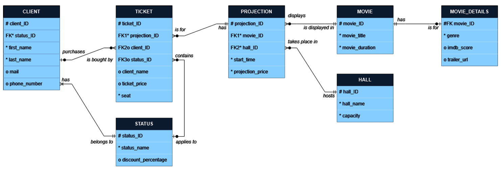

# **Movie-Tickets-Database**

This project implements a relational database for managing the movie ticket purchase process. 

### Database Structure and ER Diagram
* 7 entities: CLIENT, STATUS, TICKET, PROJECTION, HALL, MOVIE, MOVIE_DETAILS
* Relationships: 1:M, 1:1

  

### Integrity Constraints
* Referential: Primary Key & Foreign Key
* Check, Not null, Unique

### Transactions
Transactions follow the ACID principles and are used to ensure data consistency and integrity in scenarios such as:
* Ticket purchase: Manages the purchase of multiple tickets in a single transaction, allowing a client to buy tickets for multiple individuals at once.
* Ticket cancellation: Removes the ticket’s association with a customer and, if applicable, deletes the customer.
* Screening cancellation: Cascades the deletion of screenings, tickets, and associated customers without active tickets.

### Key Functionalities
* Hall occupancy rate: Identifies underutilized or overutilized halls to optimize movie scheduling.
* Movie popularity: Tracks ticket sales per movie to inform scheduling decisions.
* Customer status analysis: Analyzes ticket sales by customer category to evaluate discount strategies.
* Top customers: Identifies the most loyal customers for potential rewards programs.

### Project Scope and Future Improvements
The current project version ensures efficient ticket management, but it does not handle screening overlap verification. Future improvements may include more complex time validation mechanisms to further enhance reliability.
